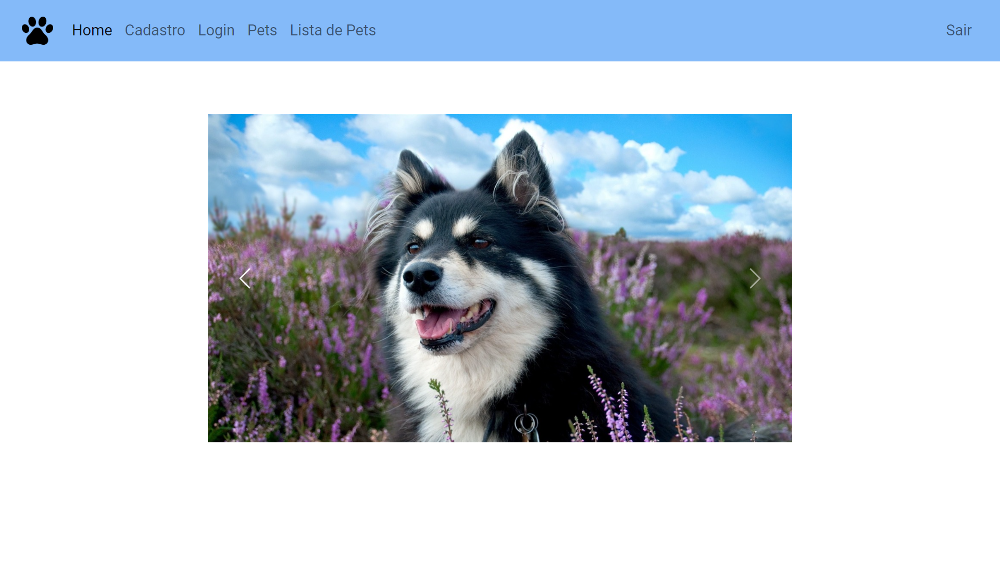
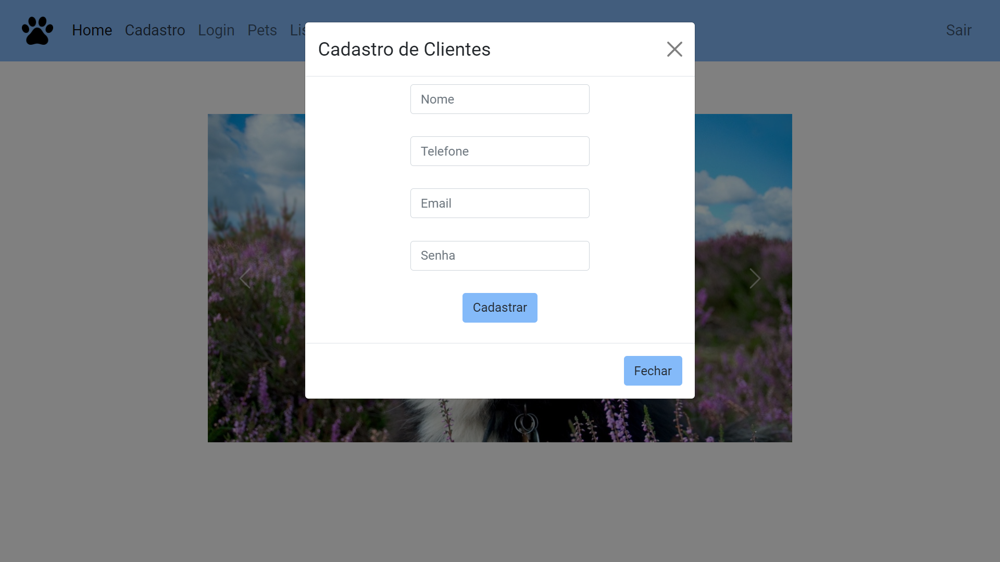
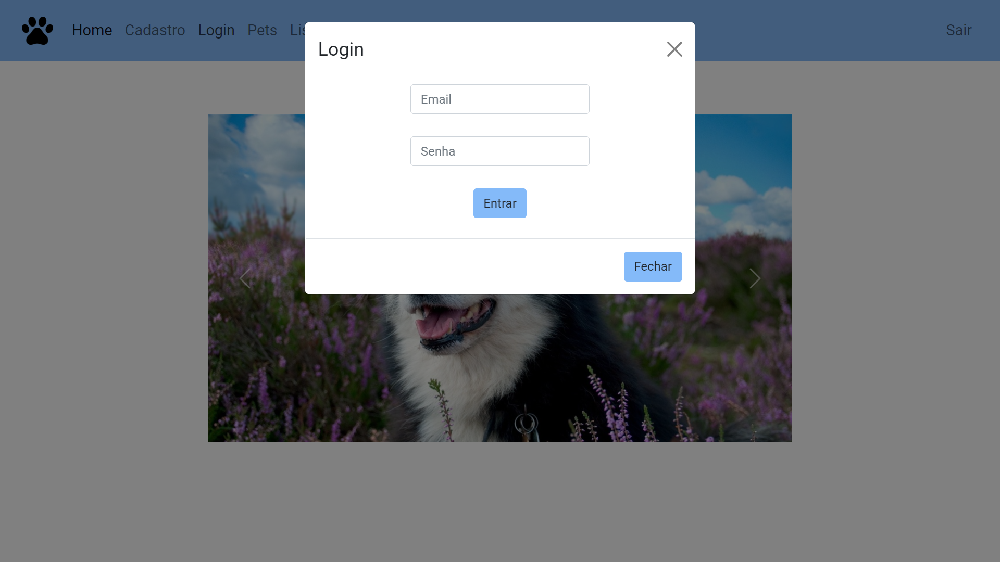
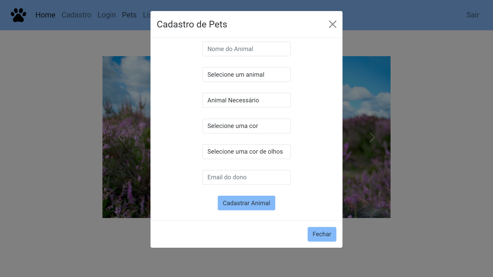
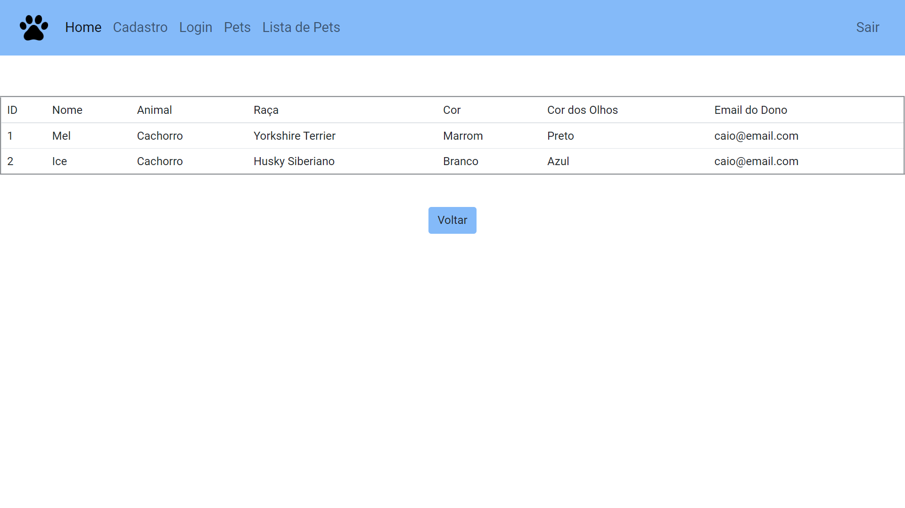

<h2 align="center">
    SISTEMA PETSHOP
</h2>

<h3>Ideia Geral</h3>

Este é um sistema de controle de um petshop desenvolvido como trabalho de conclusão de semestre do 3° ano no Curso Técnico em Informática Integrado ao Ensino Médio no Instituto Federal de Educação, Ciência e Tecnologia de
São Paulo
 

<h3>Funções Incluídas</h3>
<ul>
    <li>Cadastro de usuários</li>
    <li>Sistema de login</li>
    <li>Cadastro de pets</li>
    <li>Listagem dos pets cadastrados</li>
    <li>Responsividade para dispositivos móveis e <i>desktop</i></li>
    <li>A lista de pets e o cadastro de pets necessita de um login ativo</li>
</ul> 

<h3>Funções Futuras</h3>
<ul>
    <li>O cadastro de pets não pedirá o email do dono, o ID será pego de acordo com o usuário logado</li>
    <li>A página de listar pets mostrará apenas os pets do usuário logado</li>
    <li>Adicionar mais informações na página Home</li>
    <li>Alterar o estilo do carrossel de imagens na Home</li>
</ul> 

<h3>Como incluir o banco de dados</h3>

Inclua os códigos do banco de dados na ordem abaixo
 
<ol>
    <li>petshop.sql</li>
    <li>clientes.sql</li>
    <li>animais.sql</li>
</ol>

<h3>Preview</h3>
 
 
 
 
 